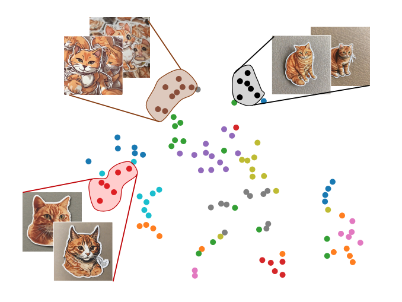

# Cohesive_clustering
Clustering approach where the consistency is preserved.

## Concept
Using approach in the paper [**The The Chosen One: Consistent Characters in Text-to-Image Diffusion Models** ](https://arxiv.org/abs/2311.10093), I augmented clustering approach to identify consistent image clusters for a given dataset.

*consistency refers to finding a representation that same across all the other instances.*



*For the above image, the most cohesive cluster would be the cluster depicting black dots as its instances are more closer to its cluster centroid(higher consistency).*

If the clustering approach works well, we can find the optimal set clusters that each of them has unique set of patterns. Then we can find the most cohesive cluster, aka the cluster that shows the most consistency across all the instances(features are same and consistent).

## Installation

Install necessary packages,

```bash
pip install -r requirements.txt
```

## Usage

```python
# Edit the configs files
 - set the hyperparametes

# Run the script
python clustering.py
```

## TODO
### Clustering Algorithms
- [x] Implemented kmeans++ 
- [ ] Implemented DBSCAN
- [ ] Implemented BIRCH
- [ ] Testing with Graph Clustering

### Other
- [ ] Top-k retrieval
- [ ] Support for rotational invariance of the images([see below](#results))

# Results
- Overall results are fine, there are some edge cases that need to handle seperately.
    - Some clusters might have mixed-images(probably due to either extracted features or clustering algorithm in used.)
    - Sensitive to the rotation of the image, needs to be addressed (Make this as **Rotational Invariant Method**).
- Enhance the feature extraction process: Incoporate more features that make them unique!

## Contributing

Pull requests are welcome. For major changes, please open an issue first
to discuss what you would like to change.

Please make sure to update tests as appropriate.

## License

[MIT](https://choosealicense.com/licenses/mit/)